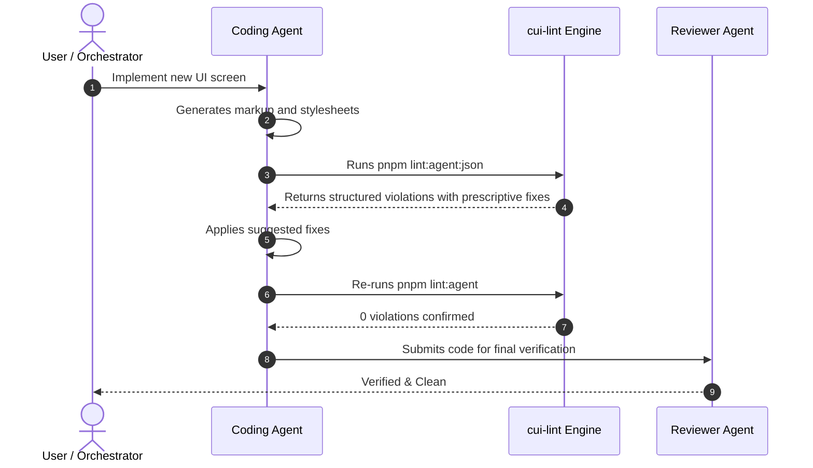

# How-To: Agent Integration & Operational Guide

This guide describes how to install, configure, and operate `cui-lint` within autonomous coding agent workflows (e.g., Claude, Gemini, GPT, Antigravity, and multi-agent orchestrators).

---

## 1. Installation & Prerequisites

`cui-lint` is native to the repository and relies on `svelte/compiler` (already included with Svelte 5) and native Node.js ESM. No external heavy packages are required.

### Verify Prerequisites
```bash
# Verify Node.js version (Node 18+ required)
node -v

# Ensure dependencies are installed
pnpm install
```

### CLI Scripts Configured in `package.json`
```json
{
  "scripts": {
    "lint:agent": "node scripts/cui-lint.mjs",
    "lint:agent:json": "node scripts/cui-lint.mjs --json"
  }
}
```

---

## 2. Configuration (`cui.config.json`)

Customize rules, token sources, and styling boundaries in [`cui.config.json`](file:///Users/amrit/fractalmandala/fractaldev/ui-compiler-playbook/engine/affedo/cui.config.json):

```json
{
  "$schema": "./schemas/cui-config.schema.json",
  "name": "cui-design-system",
  "tokens": [
    "tokens/createui.json",
    "tokens/neobrutalist.json"
  ],
  "anatomyDir": "anatomy",
  "stylesDir": "src/lib/styles/components",
  "componentsDir": "src/lib/components/generated",
  "routesDir": "src/routes",
  "rules": {
    "cui/token-purity": "error",
    "cui/no-in-component-styles": "error",
    "cui/no-component-restyle": "error",
    "cui/strict-props-and-slots": "error"
  },
  "defaultContract": {
    "allowStyleProperties": [
      "margin", "width", "max-width", "flex", "grid-column", "z-index"
    ],
    "denyStyleProperties": [
      "padding", "background", "border", "border-radius", "color", "font-family"
    ]
  },
  "spacingScale": {
    "4px": "var(--space-1)",
    "8px": "var(--space-2)",
    "12px": "var(--space-3)",
    "16px": "var(--space-4)",
    "20px": "var(--space-5)",
    "24px": "var(--space-6)",
    "32px": "var(--space-7)",
    "40px": "var(--space-8)"
  }
}
```

---

## 3. Running the Linter

### Interactive / Terminal Mode
Run a complete scan across all stylesheets, components, and routes:
```bash
pnpm lint:agent
```

Scan specific files:
```bash
node scripts/cui-lint.mjs src/routes/dashboard/+page.svelte src/lib/styles/components/button.sass
```

### Automatic Fix Mode
Automatically replace deprecated tokens (`--bg-surface` → `var(--bg)`) and raw colors where exact matches exist:
```bash
node scripts/cui-lint.mjs --fix
```

### Machine Mode (For Agent Contexts)
Output a structured JSON array for automated agent parsing:
```bash
pnpm lint:agent:json
```

---

## 4. Instructing Coding Agents

To equip coding agents with design system awareness, add the following directive to your project prompt or `.cursorrules` / `CLAUDE.md`:

```markdown
### Design System Verification & Quality Gate
Whenever you create or modify Svelte components, routes, or Sass stylesheets:
1. Always use external single-tab indented `.sass` files under `src/lib/styles/components/`. Never add `<style>` blocks in library components.
2. Consume semantic tokens exclusively (`var(--space-*)`, `var(--bg)`, `var(--stroke-*)`, `var(--radius-*)`). Never use raw hex codes or arbitrary pixel dimensions > 2px.
3. Before completing your task, run:
   ```bash
   pnpm lint:agent:json
   ```
4. If any violations are returned:
   - Read the `[DESIGN SYSTEM RATIONALE]` to understand the rule.
   - Apply the exact `[PRESCRIPTIVE AGENT FIX]` provided in the diagnostic.
   - Re-run `pnpm lint:agent` until 0 violations are reported.
```

---

## 5. Multi-Agent & CI/CD Pipelines

### Autonomous Self-Healing Loop
In multi-agent setups (e.g., Santa Method or Boss Orchestration), `cui-lint` acts as an automated, deterministic reviewer:



### GitHub Actions Workflow
Add `pnpm lint:agent` to your continuous integration pipeline:

```yaml
name: Design System Verification

on: [push, pull_request]

jobs:
  verify-contracts:
    runs-on: ubuntu-latest
    steps:
      - uses: actions/checkout@v4
      - uses: pnpm/action-setup@v3
        with:
          version: 9
      - uses: actions/setup-node@v4
        with:
          node-version: 20
          cache: 'pnpm'
      - run: pnpm install
      - run: pnpm lint:agent
      - run: pnpm check
      - run: pnpm build
```
